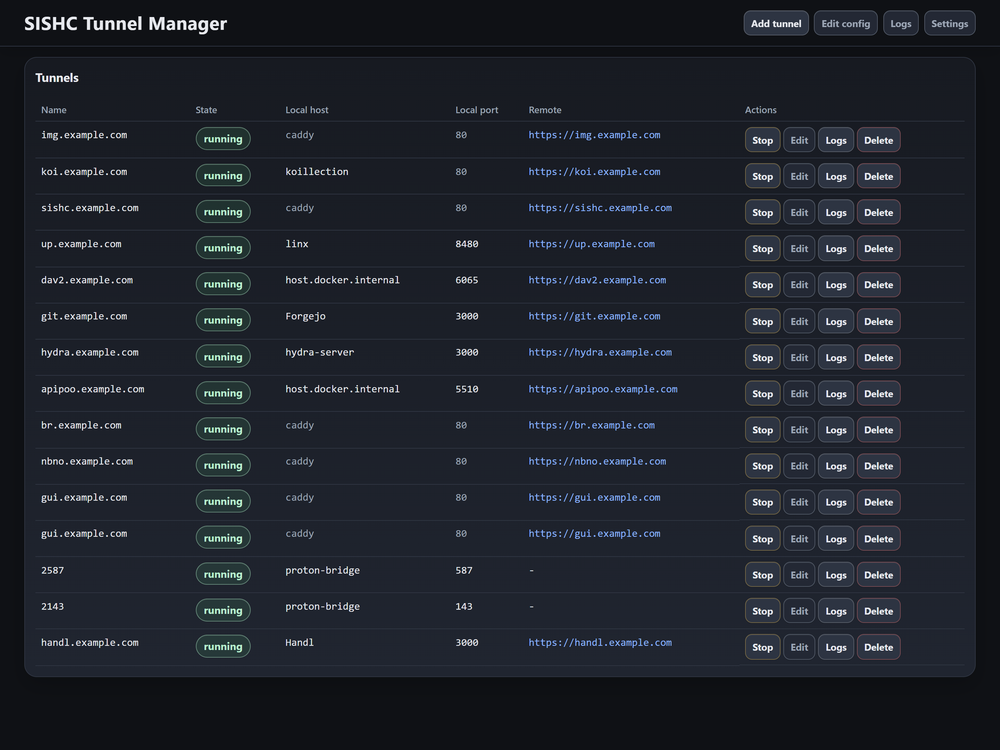
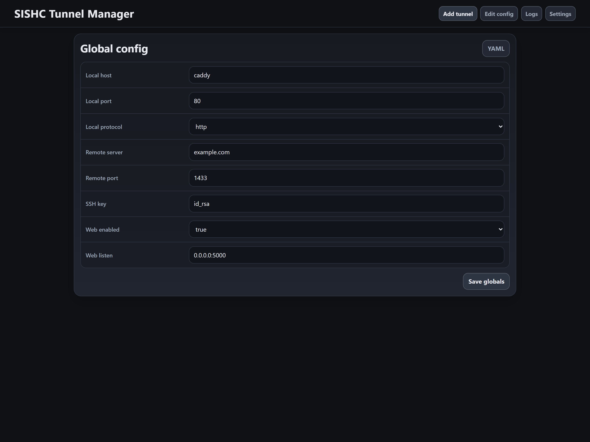
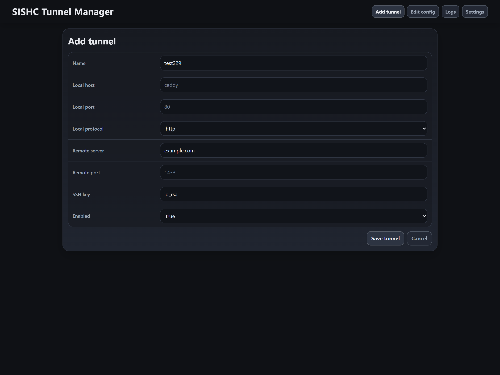
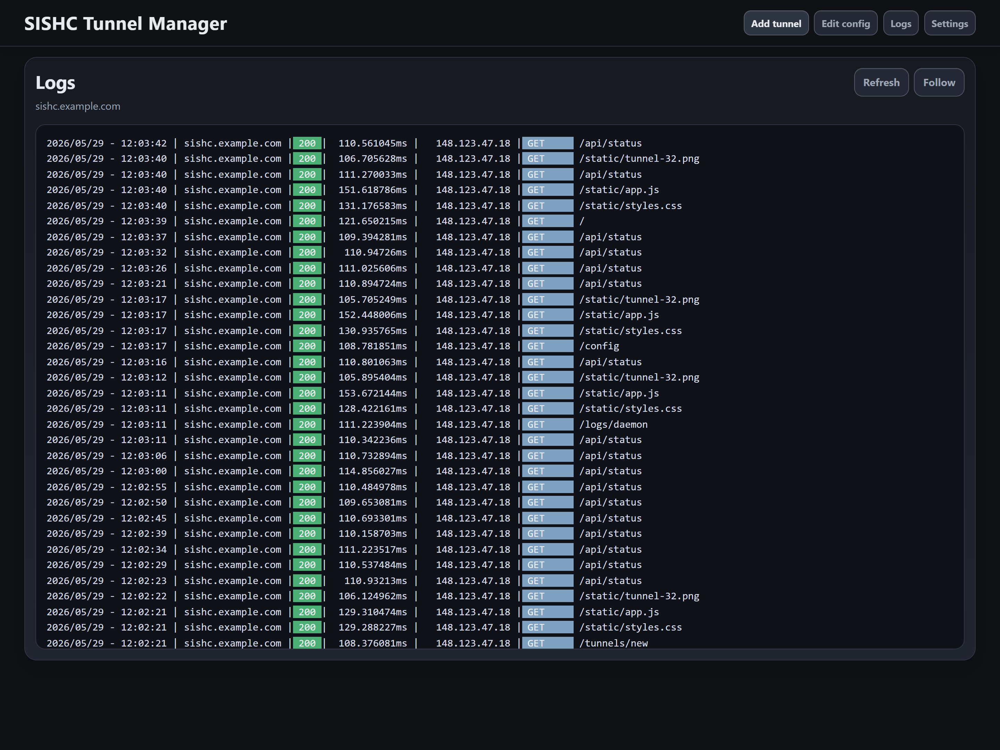

# SISHC

`sishc` is a small daemon-first CLI for managing [sish](https://docs.ssi.sh/) tunnels. It keeps a config file as source of truth, runs tunnels in the background, and exposes a Unix socket for `status`, `logs`, and `reconcile`.

The binary is called `sishc`. The release image is `ghcr.io/lanjelin/sishc:latest`.

## Quick start

Docker is the easiest way to run it.

1. Create a config in a mounted folder. Start from the example below and make sure `ssh_key`, `remote_server`, and `remote_port` are set.
2. Make the SSH key available inside the container. The simplest way is to mount it somewhere under `/config` and point `ssh_key` at that path.
3. If you want the web UI, set `web_enabled: true` and `web_listen: 0.0.0.0:5000` in the config.
4. Start the container and expose port `5000`.
5. Open the web UI in your browser.

```bash
docker run \
  -e PUID=$(id -u) \
  -e PGID=$(id -g) \
  -v "$(pwd)/config:/config" \
  -p 5000:5000 \
  ghcr.io/lanjelin/sishc:latest
```

The container reads its config from `/config/config.yaml`. It also uses `/config` for logs, the socket, and `known_hosts`.

The container runs with `PUID` / `PGID`, defaulting to `1000:1000`. Change those if your mounted `/config` belongs to a different user.

If you are running locally outside Docker, the default web bind is `127.0.0.1:5000`.

If you want the local `sishc` binary to talk to the daemon inside Docker, point it at the mounted directory:

```bash
export SISHC_CONFIG_FILE=/path/to/config/config.yaml
export SISHC_LOG_DIR=/path/to/config/logs
export SISHC_SOCKET=/path/to/config/sishc.sock
sishc status
```

## Screenshots

These are placeholders for now.

| Dashboard | Config |
| --- | --- |
|  |  |
|  |  |

## What it does

- manages tunnel config through the CLI
- writes per-tunnel logs with rotation
- supports temporary `oneoff` tunnels without touching config
- can start the web UI from config with `web_enabled: true`

It keeps config as the source of truth and runs one tunnel manager per config file.

For the server side that `sishc` connects to, see:

- https://github.com/Lanjelin/sish-starter

## Commands

```text
sishc daemon     Run the tunnel daemon
sishc status, ls Show tunnel status
sishc logs       Show tunnel logs
sishc validate   Validate config and exit
sishc reconcile  Reconcile config now
sishc add, a     Add a tunnel
sishc update, u  Update a tunnel
sishc remove, rm Remove a tunnel
sishc start      Enable a tunnel
sishc stop       Disable a tunnel
sishc oneoff, o  Run a temporary tunnel
sishc init       Create config interactively
```

Tunnel flags:

```text
--ssh-key PATH
--remote-port PORT
--remote-server HOST
--local-protocol tcp|https
```

Notes:

- `add` and `update` accept shorthand host/port forms and use globals when fields are omitted
- `update` uses `--new-name` for rename
- `start` and `stop` toggle `enabled`
- `oneoff` prints the remote server output directly and does not write config
- `status` can show one tunnel in detail
- `logs --follow` follows rotated log files

## CLI examples

```bash
sishc add test229 localhost
```

Uses the global local port and only overrides the host.

```bash
sishc update test229 :9090
```

Updates only the local port. The host stays as-is.

```bash
sishc add test331 6080
```

Uses `127.0.0.1` as the host and `6080` as the port.

```bash
sishc ls test229
```

Shows one tunnel instead of the full table.

```bash
sishc logs --follow test229
```

Follows the tunnel log live.

```bash
sishc o --local-protocol https cockpit.example.com 192.168.50.197:9090
```

One-off HTTPS tunnel to `cockpit.example.com`.

```bash
sishc oneoff test229 localhost:8080
```

One-off tunnel with a fixed remote name and local `host:port`.

## Defaults and paths

All defaults are XDG compliant.

```text
Config: ~/.config/sishc/config.yaml
Logs:   ~/.local/share/sishc/logs
Socket: $XDG_RUNTIME_DIR/sishc.sock
        or ~/.local/share/sishc/sishc.sock
```

Useful environment variables:

- `SISHC_CONFIG_FILE`
- `SISHC_LOG_DIR`
- `SISHC_SOCKET`
- `SISHC_KNOWN_HOSTS`

## Config

Example sparse config:

```yaml
ssh_key: "~/.ssh/id_rsa"
remote_port: 1433
remote_server: sish.example.com
local_host: caddy
local_port: 80

tunnels:
  - name: test1.example.com
  - name: test2
    enabled: false
    local_host: example_host
  - name: test3
    local_port: 1443
  - name: test4
    local_host: example_host2
    local_port: 3000
    ssh_key: "~/.ssh/id_rsa2"
    remote_server: sish2.example.com
    remote_port: 1723
  - name: "2512" # Expose ssh port to example.com:2512
    local_host: 192.168.50.80
    local_port: 22
    local_protocol: tcp
```

Web UI settings live in the same config:

```yaml
web_enabled: true
web_listen: 127.0.0.1:5000
```

## Install

### Download a release

Grab the `sishc` binary from GitHub Releases and drop it on your PATH.

### Build locally

```bash
go build ./cmd/sishc
```

### Run from source

```bash
go run ./cmd/sishc
```
